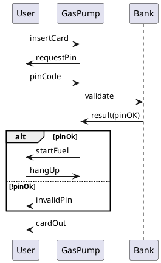

# SWTP

```plantuml
@startuml test
User -> GasPump: insertCard
GasPump -> User: requestPin
User -> GasPump: pinCode
GasPump -> Bank: validate
Bank -> GasPump: result(pinOK)
alt pinOk
GasPump -> User: startFuel
User -> GasPump: hangUp
else !pinOk
GasPump -> User: invalidPin
end
GasPump -> User: cardOut
@enduml
```

