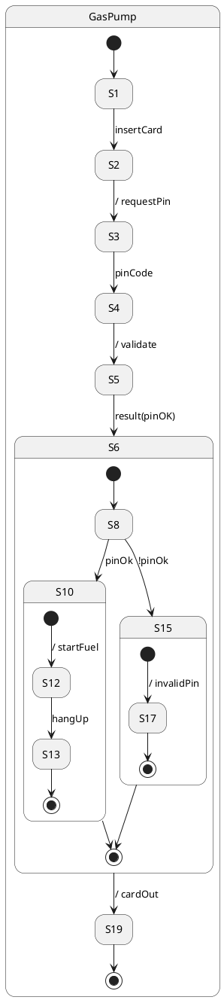

# SWTP
This repository contains the source code of a tool designed to convert [PlantUML](https://plantuml.com/) sequence
diagrams to semantically analogous state diagrams.

## Setup
### IntelliJ (Recommended)
1. Clone this repository (`git clone git@git.thm.de:omar36/swtp.git`).
2. Launch IntelliJ.
3. Open the project folder (`swtp2`) inside the cloned repository (`File->Open...`).
4. Wait for IntelliJ to finish importing and indexing the project.
5. Open `Main.java` and press the green run button next to the `main` method to compile and run the project.

### VS Code
1. Make sure Java 17 is installed and the default JDK of your system.
2. Clone this repository (`git clone git@git.thm.de:omar36/swtp.git`).
3. Launch VS Code.
4. Open the project folder (`swtp2`) inside the cloned repository (`File->Open Folder...`).
5. Install the following extensions: `Extension Pack for Java`, `Gradle for Java`
6. Open `Main.java` and press the `Run` button above the `main` method to compile and run the project.

## Demo

 

